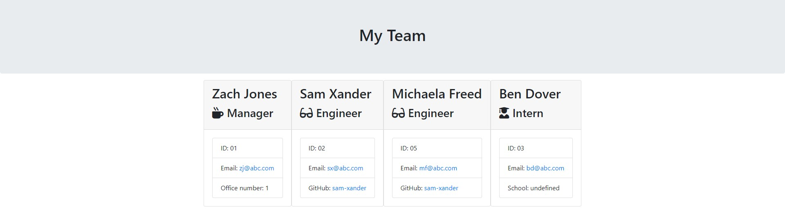

# Node.js Team Profile Generator

### View an example file [here](https://sam-xander.github.io/node-team-generator/output/team)

This is a team profile generation app that uses Node.js to create a team page with data input by the user. The app uses Inquirer to prompt the user and the FS and Path modules in Node.js to generate the page.

---

---

### Installation
 
 1. Clone the repository from [here](https://github.com/sam-xander/node-team-generator/) to your local drive.
 2. Launch your local server using the [Live Server VSCode Extension](https://marketplace.visualstudio.com/items?itemName=ritwickdey.LiveServer) or open the index.html with the [Open in Browser VSCode Extension](https://marketplace.visualstudio.com/items?itemName=techer.open-in-browser)
